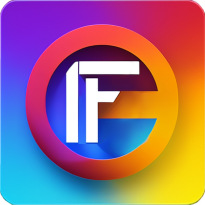

    
    

        
Fudgel

        
Write less. Do more.

    

### A lightweight web component library that eliminates pain and boilerplate.

Learning new technologies, tooling, and techniques constantly is an annoyance. Staying on the bleeding edge of technology can be painful. Why keep learning new things? Can't new things look and feel like traditional JavaScript and HTML? Yes, it absolutely can. Fudgel lets you write an HTML template and associate it with a JavaScript class. You call methods from the HTML to do things in the class. Likewise, changes in the class are automatically reflected in the HTML. You don't have to manually redraw or worry about the magic; it just works.

When given a class as a controller, Fudgel will automatically parse the HTML template and set up bindings to your controller's properties. When they change, the HTML is also updated. Fudgel also handles events, passes data as attributes and properties, and fully supports TypeScript. All of this is done while allowing you, the developer, to maintain control; add additional directives, hook into the component's lifecycle, and even handle content projection using slots.

What do you get by using Fudgel?

-   One-way data binding (controller to HTML)
-   Mustache-like syntax for text and attributes
-   Automatic updates when properties change, and only updating affected DOM nodes
-   Two-way property and attribute bindings
-   Ability to add code during different lifecycle events
-   Event handlers, tying events to your controller's methods
-   Support for styles, either automatically scoped or within a shadow DOM
-   Iterate over objects, arrays, maps, and other iterables
-   Conditionally add or remove elements
-   Dynamically apply or remove classes when properties change
-   Child element references
-   No build system or compilation needed; you can just use vanilla JavaScript
-   JavaScript works with even the most restrictive Content-Security-Policy directives (inline styles could break with a _really strict_ policy)
-   Includes support for slots in Shadow DOM, and our custom `<slot-like>` element for the Light DOM
-   Full TypeScript support
-   Published as both UMD and a module
-   Dependency injection for services, with the ability to override the container for tests
-   Darn small, coming in at about 5k compressed for the Web Component; about 7k if you include everything else
-   Fully tree-shakeable, reducing your bundle size when you don't use all of the features

<show-sample src="samples/welcome-to-fudgel.json"></show-sample>

In the above example, a new custom element is defined. Whenever you use the new HTML element `<my‑custom‑element>`, it will automatically insert "Hello Developer, welcome to Fudgel!" as text. Because of the timeout set up in `onInit` (a lifecycle method), in five seconds the text automatically changes to "Hello Super Developer, welcome to Fudgel!"

Web components make great additions to your browser-based UI because they basically work everywhere. Self-contained chunks of functionality that can eliminate lots of work on your side. Also, upgrading them or upgrading your existing framework is easier because their dependencies are built into the custom element. The downside is a bit of extra size from the wiring that has to take place, but Fudgel limits that to just the necessities.

Is this a framework? Perhaps, depending on your definition. This provides the structure and removes a lot of hassle when trying to wire up custom elements in order to make web components. It does this by providing many of the features you could see in other frameworks, while keeping the bundle size small. Fudgel only adds a few kilobytes (the complete bundle, minified and compressed) to your assets that need to be delivered.

<fudgel-sizes></fudgel-sizes>

Yes, those numbers are in bytes. As a comparison, your browser requested just this HTML, consuming about 740 bytes. The response headers and HTML were compressed and consumed about 5.2k. The entire framework is equivalent to loading _just the HTML_ for this page! Put another way, this framework is about 1/2 the size of a font used on this site or 1/30 of the logo's download size. It's almost unfair to compare this miniscule framework to other frameworks.

This is extraordinarily small when compared to some of the more popular frameworks like Angular or React. The minimal size for a standard "Hello, world!" style project using Angular is reported at 35k and React is about 46k - however, both project sizes vary immensely based on what features or workarounds you employ. A minimal "Hello, world!" application in Fudgel is barely larger than the library itself, only adding under 100 bytes beyond the library.

## Browser Support

98% of traffic from current browsers work with this library. Basically any common browser since 2020. Here is a list of the minimum supported browser versions:

| Browser          | Version | Released |
| ---------------- | :-----: | -------- |
| Chrome           |   71    | Dec 2018 |
| Edge             |   79    | Jan 2020 |
| Safari           |  12.1   | Mar 2019 |
| Firefox          |   69    | Sep 2019 |
| iOS Safari       |  12.2   | Mar 2019 |
| Samsung Internet |  10.1   | Sep 2019 |

If you need to support slightly older versions, look at Fudgel 2.x.

See the details on the most restrictive browser features required to run Fudgel using [CanIUse.com feature list](https://caniuse.com/?feats=mdn-html_elements_slot,template,mdn-api_customelementregistry,mdn-api_shadowroot,mdn-javascript_builtins_weakmap,mdn-javascript_builtins_object_getprototypeof,proxy,wf-queuemicrotask). Scroll down to the bottom and click "Show Summary". From there, make sure to select the summary type button labeled "Intersection" and change the usage drop-down in the upper right to "all tracked" to see the overall support.

## Goals and Prior Work

Fudgel was designed to make a JavaScript and HTML developer feel comfortable quickly. It does the heavy lifting via automatic bindings and updates while the developer focuses entirely on the interactions. The focus is to create self-contained web components using `window.customElements`, suitable for inclusion on any project, regardless of other frameworks being used.

This project has received the benefit of having others blaze trails in this area. There's ideas from many other projects as well.

-   [Slim.js](https://slimjs.com/) provided the starting point that a lightweight library can contain lots of functionality, such as the automatic bindings and text parser.

-   [Angular](https://angular.io/) lifecycle hooks and structural directives were useful to mimic.

-   [Alpine.js](https://alpinejs.dev/) has event handlers using `@` prefixes and modifiers.

-   [Vue.js](https://vuejs.org/) is big into using slots for content projection, plus they also have event handlers with modifiers.

-   [Skruv](https://skruv.io/) is a small library that's similar to Slim.js and is the inspiration for the CSS scoping.

-   [jsep](https://github.com/EricSmekens/jsep) is how the basis for how expressions are parsed within templates without using "eval()" or "new Function()".

-   [a-wc-router](https://github.com/colscott/a-wc-router) inspired the `<slot-like>` element for [content projection](content-projection.html) in the light DOM.

## Best Practices

Do not register your custom element in your exported module. That does not allow other developers to resolve conflicts. If your custom element is named "heading-bar" and another library uses the same named element, the conflict is unable to be worked around. Instead, export a function that allows another developer to prefix your element and any other custom elements you require.

In general, you want your element to accept data into the controller using attributes (strings) and properties (any data). Attributes have universal support, where as most support properties. When you need to send data out of your controller, send an event.
